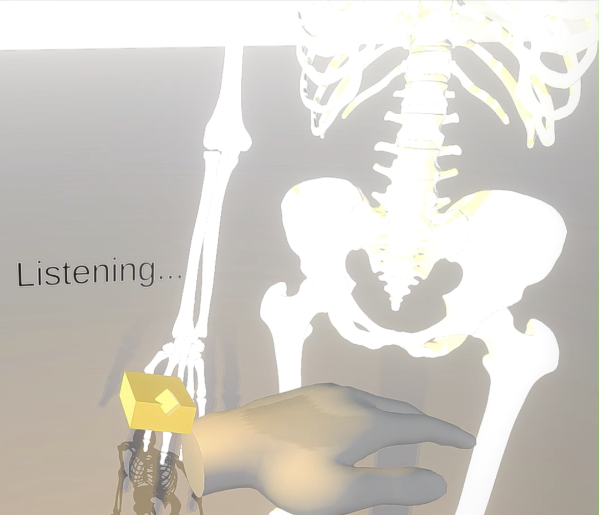

# Anatomy Quest - Use your Voice in VR to explore simple anatomy 
*Use your voice to conjure up virtual reality holograms*

**DEMO VIDEO**: a sample video of what the interactions look like here:
https://vimeo.com/648833277/02481a6588

**DESCRIPTION**: A basic proof of concept in exploring voice + hand tracking interactions in VR, for educational exploration of anatomy models.
Summon 3D models using your voice to learn anatomy faster !

Machine learning model for processing the speech was trained using the experimental Oculus Voice SDK (via wit.ai).  The model was trained on domain specific examples with keywords like "skeleton" and "lymph nodes" so that the Voice SDK would have some extra clues about what objects to expect. Wit.ai's natural language processing automatically handles the transcription from speech to text, and handles the NLP parsing to determine the intent from the speech utterance (i.e since users have a wide variety of ways of saying the same intent)
 
~~~~~~~~~~~~~~~~~~~~~~~~~
INSTRUCTIONS:

1) Download the APK and Sideload on to your Quest 2 to try it out with hand tracking enabled:
https://www.dropbox.com/s/xzalsiobj21qipd/AnatomyQuest.apk?dl=0

2) Once inside the app simply tap the button on your wrist to activate, and say what you want to see. 

3) Try hiding and showing different layers using your voice e.g. "hide the vascular system" or "show all the lymph nodes"

~~~~~~~~~~~~~~~~~~~~~~~~~

Built for Quest 2 using the latest v34 Oculus Integration package in Unity 2020.4, with hand tracking and the experimental beta of Oculus Voice SDK.
